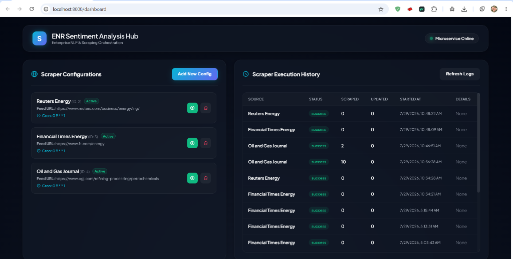
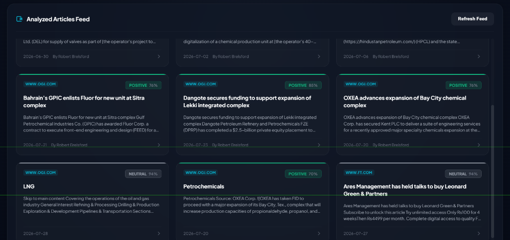
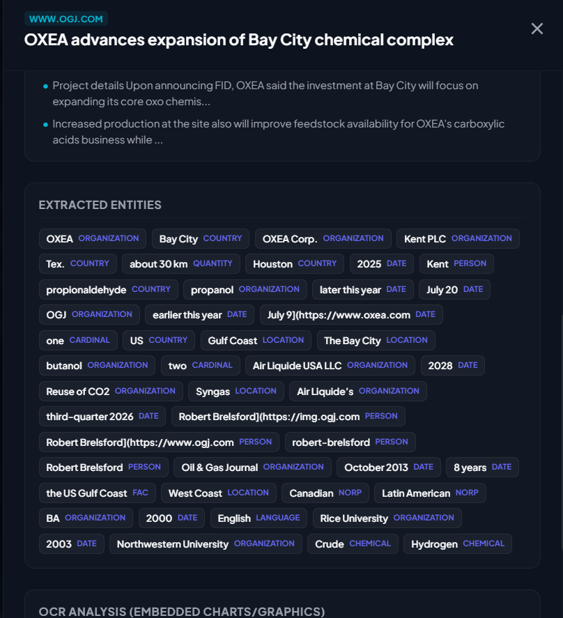
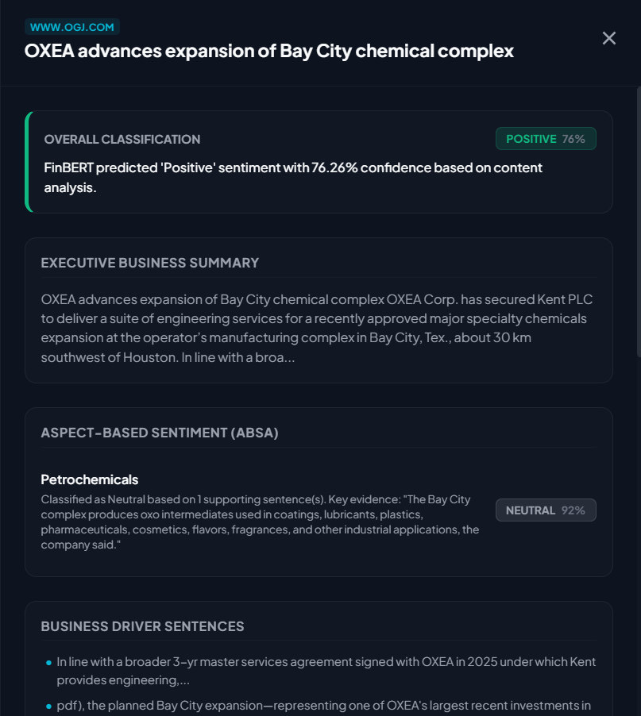
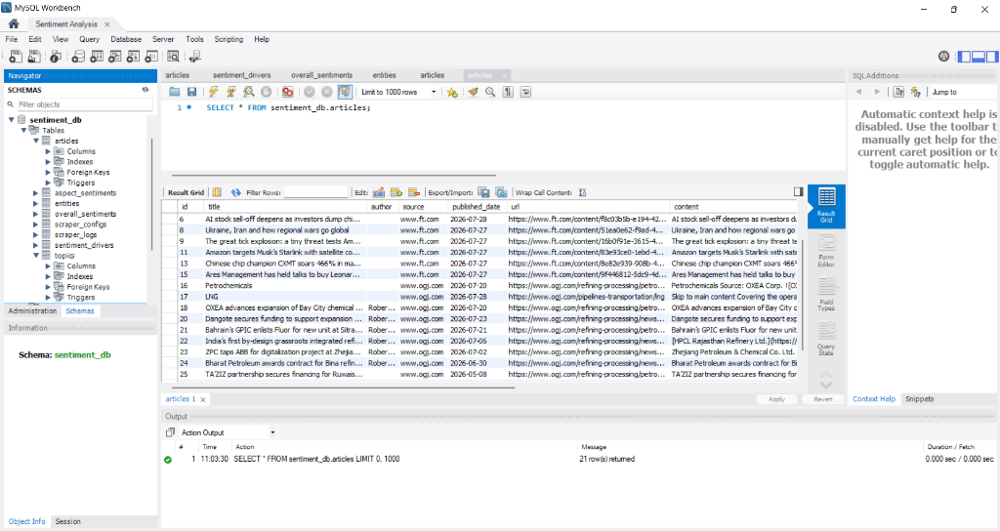
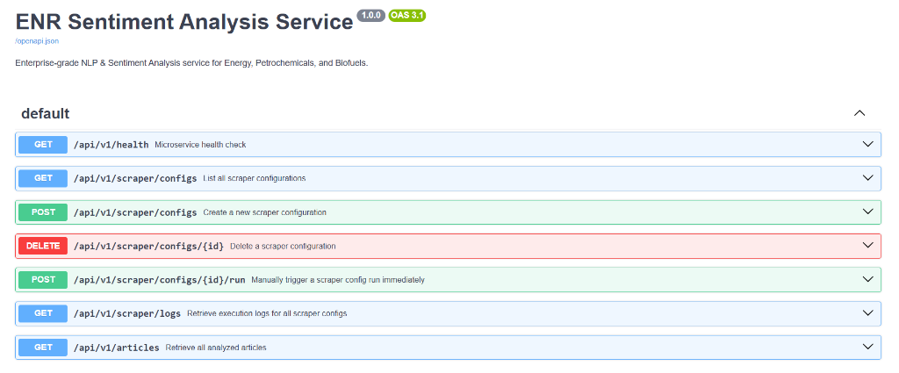

# ENR Sentiment Analysis Microservice

An enterprise-grade, modular Sentiment Analysis and Natural Language Processing microservice designed for the **Energy, Petrochemicals, and Biofuels sector**. This microservice runs an automated scheduled scraping workflow to extract articles, run OCR on embedded graphics, execute sentiment evaluation using FinBERT, perform Aspect-Based Sentiment Analysis (ABSA), and persist results in relational and vector databases.

---

## System Dashboard Preview

### 1. Configurations & Logs Overview


### 2. Analyzed Articles Feed


### 3. Named Entity Recognition (NER)


### 4. Sentiment & Aspect-Based Sentiment Details


### 5. MySQL Database Relational Tables


---

## Key Features

1. **Scraping-Based Feed Processing**: Automatically scrapes configured energy feed URLs, downloads the body text, extracts image assets, and performs OCR to merge text before NLP analysis.
2. **Scheduled Cron Workflows**: Fully integrated APScheduler triggers feed scrapers automatically (e.g., every Monday at 9 AM IST). All database records, process logs, and execution schedules are standard in the **IST (Asia/Kolkata)** timezone. Supports manual immediate triggers.
3. **Dual-Database Persistence**:
   - **MySQL**: Relational storage for article metadata, overall and aspect sentiment results, extracted entities, and scheduler logs.
   - **ChromaDB**: Vector storage for semantic embedding search and future RAG integration.
4. **Modular AI Engine**: Pluggable provider-based architecture supporting:
   - **Sentiment Analysis**: FinBERT (Financial/Business Sentiment) or standard heuristics fallback.
   - **Named Entity Recognition (NER)**: spaCy for extracting companies, organizations, chemicals, technologies, and policies.
   - **Summarization**: Extractive sentence ranking using TF-IDF.
   - **OCR (Optical Character Recognition)**: EasyOCR to transcribe embedded charts, infographics, and diagrams.
5. **Aspect-Based Sentiment (ABSA)**: Classify sentiment independently for configurable aspects: Biofuels, Petrochemicals, Hydrogen, SAF, Renewable Energy, Carbon Capture.
6. **Explainability & Drivers**: Returns specific evidence/supporting sentences and key sentiment driver bullet points.

---

## Directory Structure

```
sentiment_analysis/
├── templates/
│   └── dashboard.html  # Modern glassmorphism system dashboard UI
├── api.py              # FastAPI endpoints and dependency injection
├── core.py             # Consolidated settings, enums, logging & exception handlers
├── db.py               # Consolidated engine, session creators, models & ChromaDB client
├── main.py             # FastAPI App creation & startup lifecycle events
├── providers.py        # ML Model Interfaces and concrete implementations (spaCy, FinBERT, EasyOCR, TF-IDF)
├── schemas.py          # Unified Pydantic v2 schemas and validators
├── scraper.py          # Consolidated HTML feeds parsing and scheduled cron-jobs
└── services.py         # Scraping core, business driver explainability, and database repository logic
tests/                  # Automated pytest suite
```

---

## Installation & Setup

### Prerequisites
- Python 3.11+
- Poetry (recommended) or virtualenv with pip

### 1. Configure the Environment
Copy `.env.example` to `.env` and fill out your credentials:
```bash
cp .env.example .env
```
Ensure you set:
- `DATABASE_URL`: A valid MySQL connection string.
- `CHROMADB_PERSIST_DIRECTORY`: Path to store vector search indices locally.

### 2. Install Dependencies
Using Poetry:
```bash
poetry install
```
This will set up the virtual environment and install all packages, including PyTorch, EasyOCR, HuggingFace transformers, spaCy, and databases.

### 3. Download Spacy Language Model
Download the default english model:
```bash
poetry run python -m spacy download en_core_web_sm
```
*(Note: If not run, the SpacyNERProvider is designed to automatically download the model on its first startup).*

### 4. Running the Server
Start the development server using:
```bash
poetry run python main.py
```
Alternatively, run with Uvicorn directly:
```bash
poetry run uvicorn main:app --reload
```

---

## API Endpoints

Once the server is running, the interactive Swagger documentation is available at:
- **Swagger UI**: [http://localhost:8000/docs](http://localhost:8000/docs)



### Summary of REST endpoints
- `GET /api/v1/health`: Checks system health status.
- `GET /api/v1/scraper/configs`: List all scraper configurations.
- `POST /api/v1/scraper/configs`: Create a new scraper configuration.
- `DELETE /api/v1/scraper/configs/{id}`: Delete a scraper configuration.
- `POST /api/v1/scraper/configs/{id}/run`: Manually trigger an immediate scrape run.
- `GET /api/v1/scraper/logs`: Retrieve execution logs.
- `GET /api/v1/articles`: Retrieve all analyzed articles feed.
